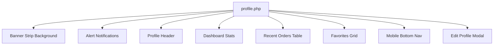

# Tài liệu thiết kế trang Cá nhân (User Profile)

Tài liệu này phân tích cấu trúc thiết kế, hệ thống thành phần (Components), kiểu dáng (Styling), tính phản hồi (Responsive) và các tương tác nhỏ (Micro-interactions) của trang Cá nhân [profile.php](file:///c:/xampp/htdocs/LAP_TRING_WEB_010412103103/views/client/pages/user/profile.php).

---

## 1. Tổng quan thiết kế (Design System & Theme)
Trang cá nhân của khách hàng được thiết kế theo phong cách **Glassmorphism** (kính mờ) hiện đại, mang lại cảm giác cao cấp, đồng bộ với giao diện quản trị (Admin).

* **Font chữ**: Sử dụng bộ font `Google Sans Flex` và `Material Symbols Outlined` cho các biểu tượng.
* **Màu sắc chủ đạo**:
  * Nền trang: `#f5f3f1` (màu kem ấm nhẹ nhàng).
  * Panel kính mờ: `rgba(255, 255, 255, 0.75)` phối hợp với `backdrop-filter: blur(24px)`.
  * Màu chữ chính: `#111827` (Đen xám đậm).
  * Màu chữ phụ: `#4b5563` (Xám).
  * Màu nhấn thương hiệu: `#8b5e3c` (Nâu đồng / vàng đất ấm).
  * Trạng thái thành công / Đã xác thực: `#10b981` (Xanh lá).
  * Trạng thái cảnh báo / Chưa xác thực: `#f59e0b` (Cam).
  * Trạng thái xóa / Hủy: `#ef4444` (Đỏ).

---

## 2. Các phân vùng chức năng (Page Layout & Structure)

Trang cá nhân hiện tại được xây dựng dưới dạng **All-in-one** gồm các phần chính sau:

### A. Banner Strip Background (`.banner-strip`)
* Nằm ở trên cùng làm nền trang trí.
* Sử dụng ảnh phủ một lớp overlay đen mờ (`rgba(0, 0, 0, 0.2)`) để tăng độ tương phản cho thông tin phía trước.

### B. Thông báo trạng thái (`.alert`)
* Hiển thị thông báo thành công hoặc lỗi từ các thao tác trước đó (như cập nhật hồ sơ thành công, gửi email xác thực thành công...).
* Có màu sắc dịu nhẹ, đi kèm biểu tượng trạng thái trực quan (`check_circle` / `error`).

### C. Hồ sơ cá nhân (`.profile-header-section`)
* **Avatar**: Vòng tròn chứa biểu tượng người dùng kèm theo **Huy hiệu xác thực (Verified Badge)** màu xanh lá nếu tài khoản đã được xác minh.
* **Tên người dùng**: Đi kèm nút sửa hồ sơ nhanh dạng bút chì (`edit`).
* **Huy hiệu Thành viên**: Badge phân loại hạng thành viên (ví dụ: Thành viên Bạc).
* **Nút xác thực**: Nếu tài khoản chưa xác thực, hiển thị nút màu cam liên kết đến hành động gửi mail xác minh.
* **Bảng thông tin chi tiết**: Grid 2 cột hiển thị Email, Số điện thoại và Địa chỉ (chiếm trọn 2 cột).

### D. Chỉ số thống kê (`.dashboard-stats`)
Gồm 3 hộp thông tin dạng thẻ kính (`stat-box`):
1. **Đơn hàng**: Hiển thị tổng số đơn hàng đã mua.
2. **Yêu thích**: Đếm số sản phẩm đang có trong danh sách yêu thích.
3. **Voucher**: Số lượng mã giảm giá khả dụng (mặc định: `0`).

### E. Đơn hàng gần đây (`.recent-orders-section`)
* Giao diện bảng (`.orders-table`) hiển thị các cột: Mã đơn hàng, Ngày mua, Trạng thái, Tổng tiền.
* Trạng thái đơn hàng được hiển thị dưới dạng Badge màu sắc riêng biệt:
  * Hoàn thành: Xanh lá (`status-completed`).
  * Đang giao / Chờ xử lý: Xanh dương / Cam (`status-shipping`).
  * Đã hủy: Xám nhạt.

### F. Sản phẩm yêu thích (`.favorites-section`)
* Hiển thị danh sách sản phẩm dưới dạng lưới (Grid).
* Mỗi thẻ sản phẩm (`.product-item-card`) gồm: Ảnh sản phẩm, nút bỏ thích nhanh (trái tim đỏ), tên sản phẩm và giá tiền.

### G. Modal Chỉnh sửa hồ sơ (`#edit-profile-modal`)
* Một hộp thoại xuất hiện đè lên màn hình (`position: fixed`).
* Chứa form cập nhật: Họ tên, Số điện thoại, Địa chỉ.
* Nút "Hủy" và "Lưu thay đổi" được thiết kế rõ ràng.

---

## 3. Tính phản hồi (Responsive Design)

Giao diện được tối ưu hóa hiển thị tốt trên mọi loại kích cỡ màn hình:

* **Màn hình lớn (Desktop)**: Các bảng, thẻ stats và danh sách yêu thích hiển thị đầy đủ trên layout rộng.
* **Màn hình trung bình (Tablet - max-width: 991px)**:
  * Khoảng cách padding được thu gọn.
  * Lưới thống kê và sản phẩm yêu thích co giãn phù hợp.
* **Màn hình nhỏ (Mobile - max-width: 767px)**:
  * Ẩn thanh header/menu truyền thống của desktop, thay vào đó hiển thị thanh điều hướng dưới cùng di động (`.bottom-nav-mobile`) cố định ở mép dưới màn hình với các nút: Shop, Giỏ hàng, Tôi.
  * Bảng đơn hàng chuyển sang dạng cuộn ngang (`overflow-x: auto`) hoặc xếp chồng thông tin.
  * Các nút hành động được làm to hơn để dễ chạm.

---

## 4. Tương tác nhỏ (Micro-interactions)

* **Hover hiệu ứng**:
  * Các nút sửa hồ sơ, nút xác thực co giãn nhẹ (`scale`) và đổi màu mượt mà khi di chuột qua.
  * Thẻ sản phẩm yêu thích có hiệu ứng đổ bóng sâu hơn và ảnh zoom nhẹ khi hover.
* **Nút yêu thích**: Khi click vào biểu tượng trái tim trong danh sách yêu thích, nó sẽ lập tức mờ đi và thẻ sản phẩm đó tự động biến mất khỏi giao diện một cách mượt mà nhờ JS, đồng thời số lượng yêu thích trên bộ đếm thống kê tự động trừ đi 1 mà không cần tải lại trang.
